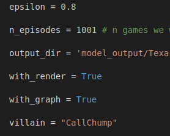

# Poker Bot Using Model-free Deep Reinforcement Learning Algorithms

[Link to main code](https://github.com/garyjh126/MLFYP_Project/tree/master/main_files/holdem "Named link title")

## Requirements ##

    pip install gym
    pip install treys
    pip install keras

## Instructions ##

To review the DQN at optimal performance, go to [this open Jupyter Notebook](https://colab.research.google.com/drive/1L_fNNEGkZcBInyVv-br1gUkMOh7sWYYZ "Named link title"), and click 'Open in Playground'. Run all the cells in the notebook and observe the output. Rendering can be switched on and off.

Alternatively, the code can be run from the DQN.py script [here](https://github.com/garyjh126/MLFYP_Project/tree/master/main_files/holdem "Named link title"). The Monte-Carlo simulation can also be run here. 
    
**Example**

     python monte_carlo.py
     python DQN.py
     
 ### Changing Hyperparameters ###
 
 The hyperparameters can be changed from within the text editor if the user wants to disable rendering etc. By default, they are set in both monte_carlo.py and DQN.py as follows:
 

The project is inspired by the work of the students and teachers at the [University of Alberta](http://poker.cs.ualberta.ca/). The project set out here was named [Cepheus](http://poker.srv.ualberta.ca/).

I also take inspiration from other ambitious projects which set out to solve No limit Texas Hold 'em which has extended complications due to the continuous range of betting values; hence the label 'No limit'. Such projects include [Deepstack](https://matchpoker.net/deepstack-ai/) and [Libratus](https://www.cs.cmu.edu/~noamb/papers/17-IJCAI-Libratus.pdf).

 ")

# Background

Poker is recognised as the quintessential game of imperfect information. Researchers around
the world have explored the depths of problems associated with solving such games and only a
handful have been successful in applying their methods to the game of poker. The recent
success of researchers sparked global interest and serves as the context for building a poker
bot in today’s climate. Contained in this project report will be a discussion about the research
carried out in solving the game of Limit Texas Hold’em and a personal pursuit in building a bot
that can do something similar.
The main purpose of this project is to test applications of deep reinforcement learning methods
on an imperfect information environment, to derive results, and hopefully build an intelligent
poker bot in the process.

## Cepheus – AI playing Limit Texas Hold’em Poker

Even though the titles of the research papers claim solving poker – formally it was essentially solved. Essentially solving Heads Up Limit* Texas Hold’em meant researchers were able to come up with an approximation (indistinguishable from original one for human during a lifetime) of a strategy profile coined 'Nash Equilibrium'. In two person zero-sum games playing a strategy from a Nash Equilibrium is also the best any player can do in case of no knowledge of his opponent’s strategy.

## DeepStack 

Around 2 years after Cepheus, another successful poker bot was revealed – this time it could win against humans in no limit version of Heads Up Texas Hold’em. Its name was DeepStack and it used continual re-solving aided by neural networks as a core.

Re-solving is one of the **subgame solving techniques**. Subgame is a game tree rooted in current decision point. From the very high-level view then subgame solving means solving a subgame in separation from the parent nodes. In other words re-solving is a technique to reconstruct a strategy profile for only the remainder of the game at given decision point.

Creators of Deepstack used **continual re-solving** where only two vectors were maintained throughout the game. The two vectors turned out to be sufficient to continuously reconstruct a strategy profile that approximates Nash Equilibrium in a current subgame (decision point). 

## Counterfactual Regret Minimization

CFR is a self-play algorithm: it learns to play a game by repeatedly playing against itself.  The program starts off with a strategy that is uniformly random, where it will play every action at every decision point with an equal probability.  It then simulates playing games against itself.  After every game, it revisits its decisions, and finds ways to improve its strategy.  It repeats this process for billions of games, improving its strategy each time.  As it plays, it gets closer and closer towards an optimal strategy for the game: a strategy that can do no worse than tie against any opponent.

The way it improves over time is by summing the total amount of regret it has for each action at each decision point, where regret means: how much better would I have done over all the games so far if I had just always played this one action at this decision, instead of choosing whatever mixture over actions that my strategy said I should use?  Positive regret means that we would have done better if we had taken that action more often.  Negative regret means that we would have done better by not taking that action at all.  After each game that the program plays against itself, it computes and adds in the new regret values for all of its decisions it just made.  It then recomputes its strategy so that it takes actions with probabilities proportional to their positive regret.  If an action would have been good in the past, then it will choose it more often in the future.

It repeats this process for billions of games.  So you have this long sequence of strategies that it was using on each game.  Counter-intuitively, that sequence of strategies does not necessarily converge to anything useful (although it sometimes does so in practice, now, with the new CFR+ algorithm described in the Science paper).  However, in a two-player zero-sum game, if you compute the average strategy over those billions of strategies in the sequence, then that average strategy will converge towards a Nash equilibrium for the game.  After it's finished learning how to play by playing against itself, it doesn't have to change any further: it just uses that average strategy against any human or computer opponent it faces.

